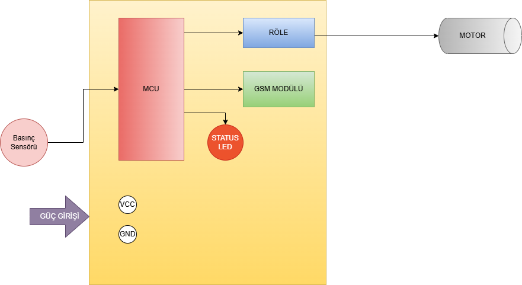

# Damlama Sulama Sisteminde Otomatik Kontrol ve İzleme Modülü Geliştirilmesi

## 1. Giriş
### 1.1 Projenin Tanımı
Tarımsal sulamada kullanılan damlama sulama sistemlerinde yaşanan operasyonel sorunları çözmek amacıyla tasarlanmıştır.

### 1.2 Projenin Amacı ve Hedefleri
**Amaç:**
- Su kesintisi durumunda pompanın otomatik durdurulması ve kullanıcıya bildirim gönderilmesidir.

**Hedefler:**

- Basınç sensörü tabanlı otomasyon sistemi tasarımı
- Gerçek zamanlı izleme ve SMS bildirim entegrasyonu

## 2. Mevcut Durum Analizi
### 2.1 Problem Tanımı
**Dizel motorla** çalışan **santrifüjlü** damla sulama sisteminde, su kesintisi gibi durumlarda sistemde **basınç düşüşü** meydana gelmekte; bu durum fark edilip zamanında müdahale edilmediğinde santrifüj pompa zarar görmekte ve kullanılamaz hale gelmektedir. Sistemde yalnızca **mekanik** denetim mekanizmaları bulunduğundan, bu tür arızaların erken tespiti ve müdahalesi için sistemin sürekli olarak insan gözetimi altında tutulması gerekmektedir. Otomatik kontrol veya uzaktan izleme altyapısının bulunmaması, denetimi tamamen operatör müdahalesine bağımlı kılmakta ve bu da sistemin genel güvenilirliğini ciddi şekilde tehlikeye atmaktadır.

### 2.2 Önceki Çalışmalar

- Operatör gözetimine dayalı geçici çözüm
- Otomasyon eksikliği nedeniyle verim düşüklüğü

## 3. Çözüm Önerileri
### 3.1 Önerilen Çözümler
1. **Basınç İzleme Sistemi**

   - Basınç sensörü entegrasyonu
   - Gerçek zamanlı ölçüm

2. **Otomatik Durdurma Mekanizması**

   - Mikrodenetleyici kontrollü röle
   - Solenoid valf ile yakıt kesme

3. **Kullanıcı Bildirim Sistemi**

   - GSM modülü ile SMS uyarısı

### 3.2 Uygulama Adımları

1. Donanım entegrasyonu
2. Yazılım geliştirme
3. Sistem testleri
4. Son kullanıcı eğitimi

## 4. Teknik Özellikler

| Bileşen | Model |
|---------|-------|
| Mikrodenetleyici | STM32F103RC | 
| Basınç Sensörü | DFRobot SEN0257 |
| GSM Modülü | SIM800L | 
| Solenoid Valf | UNOX 24V DC | 

## 5. 🔄 Sistem Blok Diyagramı

## 6. Proje Zaman Çizelgesi
| Aşama | Süre |
|-------|------|
| Analiz | 2 Hafta |
| Tasarım | 2 Hafta |
| Uygulama | 1 Hafta |
| Test | 1 Hafta |

## 7. Sonuç ve Öneriler
**Kazanımlar:**
- Gerçek saha koşullarında çalışan, düşük maliyetli, modüler ve geliştirilebilir elektronik  bir kart ile **Santrifüj yanması gibi büyük zararlar** önlenecektir. 

**Öneriler:**

- IoT entegrasyonu
- Periyodik bakım programı

