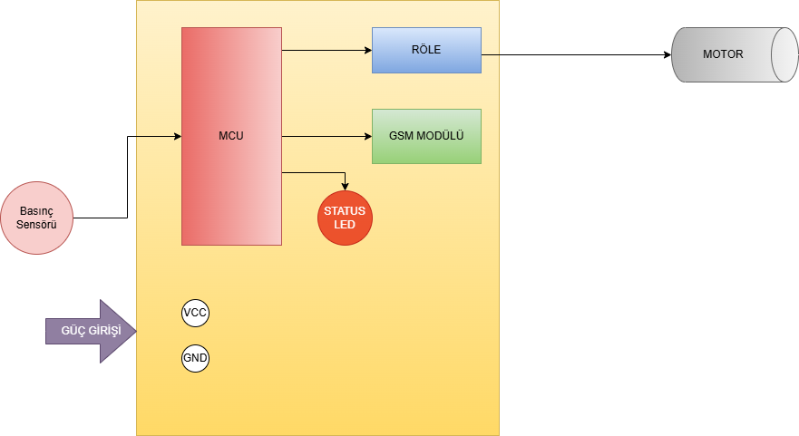

<<<<<<< HEAD
# 🚜 Basınç Düşüşü Uyarı Sistemi 

## PCB ile Koruma ve Uyarı Sistemi 
=======
# 🚜 Basınç Düşüşü Uyarı Sistemi Tasarımı

## PCB ile Santrifüj Koruma ve Uyarı Sistemi 
>>>>>>> 6a73c5a402d2e81f1217e4a9785c8820966e40d0

## ⚠️ Problem 

* 🟠  **Dizel motorla** çalışan **santrifüjlü** damla sulama sistemlerinde, su kesintisi gibi durumlarda sistemde **basınç düşüşü** meydana gelmekte; bu durum fark edilip zamanında müdahale edilmediğinde santrifüj pompa zarar görmekte ve kullanılamaz hale gelebilmektedir. Sistemde yalnızca **mekanik** denetim mekanizmaları bulunduğundan, bu tür arızaların erken tespiti ve müdahalesi için sistemin sürekli olarak insan gözetimi altında tutulması gerekmektedir. Otomatik kontrol veya uzaktan izleme altyapısının bulunmaması, denetimi tamamen operatör müdahalesine bağımlı kılmakta ve bu da sistemin genel güvenilirliğini ciddi şekilde tehlikeye atmaktadır.

---

## 💡 Çözüm Yöntemi

<<<<<<< HEAD
* 📏 **Basınç sensörü**  ile sahadan elde edilen veri Mikrodenetleyiciye iletilecek.
* 🧠 Mikrodenetleyici elde edilen veriyi işleyecek.
* ⚠️  İstenmeyen bir veri olması durumunda sistemimiz motorun yakıtını keserek **durmasını sağlayacak**.
=======
* 📏 **Basınç sensörü**  ile sahadan elde edilen veri Mikrodenetleyiciye iletilecek 
* 🧠 Mikrodenetleyici elde edilen veriyi işleyecek.
* ⚠️  İstenmeyen bir veri olması durumunda sistem **otomatik olarak kapatılacak**
>>>>>>> 6a73c5a402d2e81f1217e4a9785c8820966e40d0
* 📶 Ardından **GSM modülü** **SMS ile** kullanıcıya haber verecek.
* 🔩 Tüm bileşenler özel tasarımlı bir **PCB** üzerinde olacak ve gereken güç aküden sağlanacaktır.

---

## 🔄 Sistem Blok Diyagramı

---

## 🧾 Sonuç

✅ Bu proje ile:

* 💥 Gerçek saha koşullarında çalışan, düşük maliyetli, modüler ve geliştirilebilir elektronik  bir kart ile **Santrifüj yanması gibi büyük zararlar** önlenecektir.  

