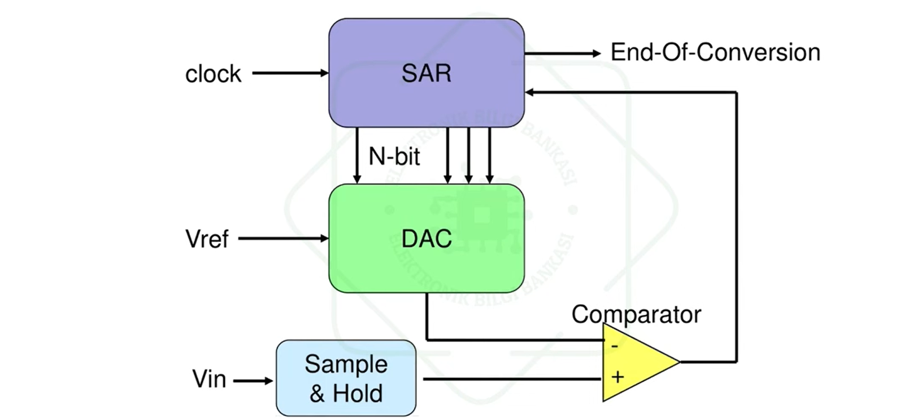
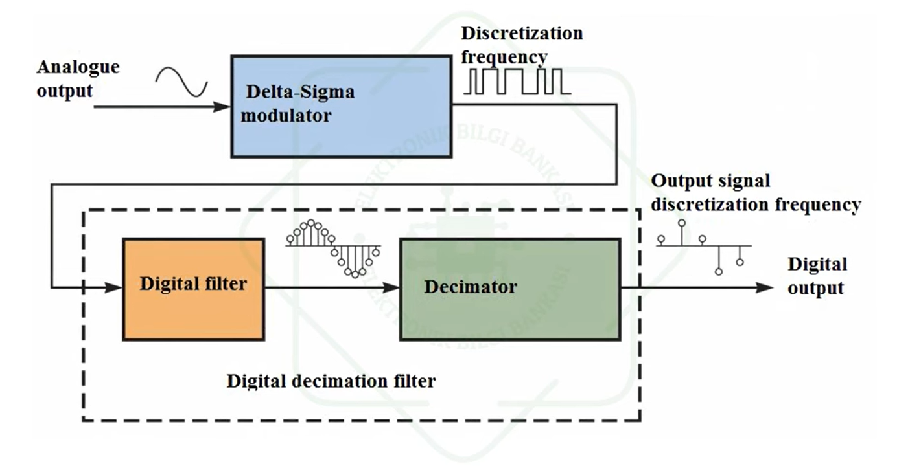
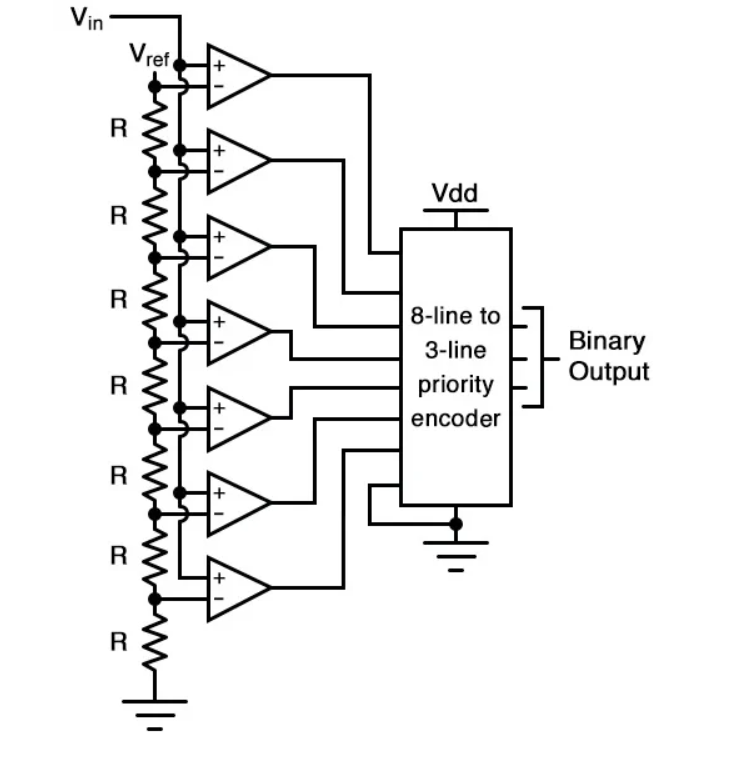
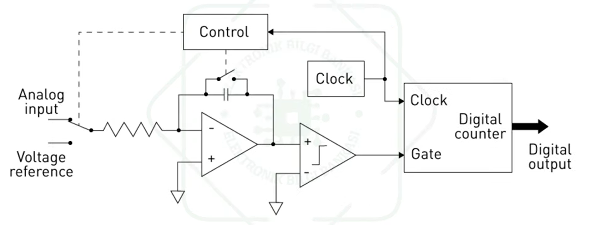
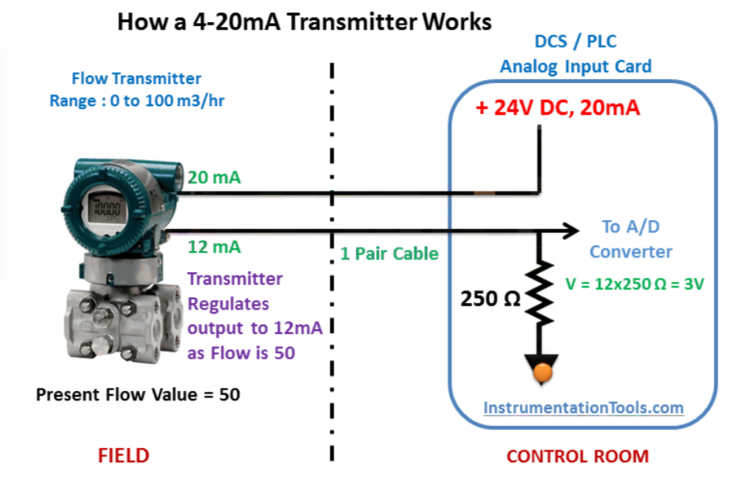

**SİNYAL ÇEŞİTLERİ**

**Analog sinyal,** zamana göre sürekli ve kesintisiz değişen sinyallerdir , sonsuz sayıda değer alabilirler.Doğada bulunan birçok sinyal analogdur (ses, ışık, sıcaklık gibi).

**Dijital sinyal,** belirli seviyelerde (genellikle "0" ve "1") kesikli değerler alır. Analog sinyalin örneklenip sayısallaştırılmasıyla oluşur.Bilgisayar ve dijital cihazlar tarafından işlenebilir.

---
**ADC NEDİR (Analog-to-Digital Converter) ?**
--

**ADC (Analog-to-Digital Converter – Analog Dijital Dönüştürücü ),** elektronik devrelerde  **analog sinyalleri dijital sinyallere dönüştüren** önemli bir devre elemanıdır. Bu dönüşüm  sayesinde mikrodenetleyiciler (MCU),bilgisayarlar ve diğer dijital sistemler  analog sinyalleri (örneğin bir sıcaklık sensörü, basınç sensörü,  vs.) okuyabilir ve işleyebilirler. 

ADC nin yaptığı bu işlem **örnekleme (sampling), tutma (hold), nicemleme (quantization) ve kodlama (encoding)** adımlarını içerir.

---
**ADC ÇALIŞMA PRENSİBİ**
---

 **1- ÖRNEKLEME (Sampling)**

Sürekli değişen analog sinyalin **belirli zaman aralıklarında değerlerinin  alınmasına örnekleme** denir. **Örnekleme frekansına bağlı olarak analog sinyalin ne kadar ayrıntılı yakalandığı** belirlenir. Örnekleme frekansı 2 kHz ise saniyede 2000 kez ölçüm yapılıyor demektir.Nyquist Teoremine göre en iyi dönüşüm için **örnekleme frekansının sinyaldeki en yüksek frekansın en az 2 katı** olması gerekir. Örneğin, insan kulağı ~20 kHz duyabildiği için CD kalitesinde ses örnekleme hızı 44.1 kHz seçilir.

**2-TUTMA (Hold)**

Örneklenen sinyal değeri, **kararlı bir şekilde tutulur (hold) ve ADC’nin işleme alması** sağlanır. Buradaki amaç Örnekleme sırasındaki voltaj değişimlerini engellemektir böylece dijitale dönüştürme işlemi yapılırken sinyal değişmez.

**3-KUANTİZASYON**

Kuantizasyon **örneklenen analog sinyallerin dijital değerlere çevrilmesi** işlemidir. Bu aşamada her bir sinyal değeri en yakın dijital değere yuvarlanır. **ADC nin çözünürüğüne bağlı olarak bu dijital değerlerin ne kadar hassas olduğu** anlaşılır. Örneğin 8 bit çözünürlüğe sahip bir ADC 256 farklı seviyeyi temsil edebilirken 16 bit çözünürlüğe sahip bir ADC 65.536 farklı seviyeyi temsil edebilir.

**4-KODLAMA (Encoding)**

Kuantize edilen değer, ikili (binary) forma çevrilir.

 
## ADC Hesaplama Örneği

### ADC Özellikleri:
- **Çözünürlük:** 10 bit  
- **Referans Voltajı (Vref):** 5V  
- **Ölçülen Voltaj:** 3.2V

---

### 🔹 Bir Adımın Değeri:

$$
\text{Adım başına voltaj} = \frac{V_{ref}}{2^{\text{bit}}} = \frac{5V}{1024} \approx 4.88\, \text{mV}
$$

---

### 🔹 Dijital Değer Hesabı:

$$
\text{Dijital Değer} = \frac{3.2V}{4.88\, \text{mV}} \approx 656
$$

---

### 🔹 İkili Karşılık:

$$
656_{10} = 1010010000_2
$$

---

 Yani 3.2V'luk bir analog sinyal, 10 bit çözünürlüklü bir ADC'de 656 sayısına ve bu da ikili sistemde 1010010000 değerine karşılık gelir.

---
 **ADC Performansını Belirleyen Bazı Önemli Parametreler**
---

**ÇÖZÜNÜRLÜK**

 ADC'nin dijital çıktıdaki bit sayısını ifade eder.Bu bit sayısı sinyalin ne kadar hassas bir şekilde ölçüldüğünü belirler.Örneğin **8 bit çözünürlüğe sahip bir ADC giriş sinyalini 256 farklı değere dönüştürebilirken 16 bit çözünürlüğe sahip bir ADC 65.536 farklı değere** dönüştürebilir.

**ÖRNEKLEME HIZI (Sampling Rate)**

ADC'nin saniyede kaç kez örnek aldığını ifade eder. Örnekleme hızı ne kadar yüksekse sinyalin o kadar fazla ayrıntısı yakalanır. Hızlı değişen sinyallerin olduğu uygulamalarda yüksek örnekleme hızı gereklidir.

**LİNEERLİK** 

ADC'nin giriş sinyali ile dijital çıktı arasındaki ilişkinin doğruluğunu belirtir. İdeal bir adce giriş sinyalinin her adımını eşit büyüklükte dijital değerlere dönüştürmelidir ancak gerçek dünyada bu herzaman mümkün olmaz ve küçük sapmalar olabilir.

 **SİNYAL-GÜRÜLTÜ ORANI(SNR - Signal to Noise Ratio)**

 ADC'nin sinyali gürültüden ne kadar ayırabildiğini ifade eder.Daha yüksek bir SNR sinyalin daha net olduğunu ve gürültüden daha az
etkilendiğini gösterir.

**GÜÇ TÜKETİMİ**

Özellikle batarya ile çalışan sistemlerde kritik öneme sahiptir.Düşük güç tüketimli ADC’ler taşınabilir cihazlarda tercih edilir.

---
**ADC ÇEŞİTLERİ ve KULLANIM ALANLARI**
---

ADC farklı çalışma prensibi ve mimariye göre farklı gruplara ayrılmaktadır.Her biri farklı avantajlar ve dezavantajlar sunar . **ADC türünün uygulama alanına göre doğru seçilmesi sistemin performansı için önemlidir.** 

---
 **1-Ardışıl Yaklaşımlı ADC (SAR ADC)**

  SAR ADC analog sinyalleri dijitale dönüştüren yaygın bir ADC türüdür Bu dönüştürücülerde bir dijital analog çevirici ve dijital
  karşılaştırıcı bulunur.
  
  **Sinyalin her bitini sırasıyla tahmin ederek her adımda bir bitin değeri belirlenir ve nihayi Dijital sonucu oluşturulur.En yüksek bit değerinden başlayarak giriş sinyali dijital analog çevirici tarafından üretilen referans sinyali ile karşılaştırılır ve bu işlem tüm bitler için tekrarlanır.**
  
   En yaygın türdür **genelde mikrodenetleyicilerde** kullanılırlar.İşlem süreleri hızlıdır 12 ile 16 bit arasında çözünürlük sunarlar.Düşük güç tüketimi ve kompakt yapıları sayesinde endüstriyel kontrol sistemlerinde kullanılırlar.

---

---

**2-Delta-Sigma ADC**

Delta-Sigma ADC'ler  iki aşamadan oluşan bir çalışma prensibine dayanırlar. **İlk aşamada analog sinyal bir modülatör yardımıyla yoğun bir örnekleme işleminden geçer ardından ikinci aşamada dijital filtreleme uygulanarak sinyalin doğruluğu ve hassasiyeti artırılır.**

Delta Sigma ADC'ler 24 bite kadar çözünürlük sağlayarak düşük frekanslarda bile yüksek doğruluk sunar.Gürültüye karşı
dayanıklı olmaları bu dönüştürücülerin yüksek çözünürlük gerektiren ses sistemleri , tıbbi cihazlar gibi alanlarda tercih edilmelerine sebep olur.

---

---

**3-Flash ADC (Paralel Karşılaştırmalı ADC)**

Analog dijital dönüştürücüler arasında en hızlı çalışan türlerden
biridir. Bu dönüştürücüler çoklu karşılaştırıcı sistemi kullanarak
çalışır ve **giriş sinyalini eş zamanlı olarak farklı referans voltajları ile karşılaştırır her bir karşılaştırıcı belirli bir voltaj seviyesinden sorumludur ve sinyalin hangi aralıkta olduğunu** tespit eder. Bu paralel işlem sayesinde **dijital çıktı neredeyse anlık** olarak üretilir.

Yüksek hız gerektiren osiloskoplar ve radar sistemlerinde kullanılırlar. Dezavantajları ise yüksek maliyetli olması ,yüksek güç tüketimi ve karmaşık devre yapılarıdır.

---

---

**4-Entegre Edici ADC (Dual-Slope ADC)**

Yüksek doğruluk ve gürültü bağışıklığının önemli olduğu uygulamalar
için tasarlanmış özel bir analog dijital dönüştürücü türüdür.Bu dönüştürücüler özellikle dijital voltmetreler başta olmak üzere hassas ölçüm cihazlarında yaygın olarak kullanılırlar.

Çalışma prensibi iki aşamalı bir entegrasyonsürecine dayanır. İlk aşamada **giriş sinyali belirli bir süre boyunca entegre edilir** bu süreçte sinyal üzerindeki gürültü etkileri önemli ölçüde azaltılır. ikinci aşamada ise **entegre edilmiş sinyal bir referans voltajı kullanılarak dijital değere dönüştürülür** ve bu iki aşamalı yaklaşım dönüştürücünün gürültüye karşı oldukça dayanıklı olmasını sağlar.

---

---

---
Sensörler veriyi farklı yollarla (protokollerle) gönderebilir. Bu durumda analog veri okuma protokolleri devreye girer.
---

---
**🔌 ANALOG VERİ OKUMA PROTOKOLLERİ**
---

---
**1.)DOĞRUDAN ANALOG GİRİŞ (ADC ile)**
---

Sensör, ölçtüğü fiziksel değere karşılık gelen bir voltaj (0-5V) üretir.Bu voltaj, mikrodenetleyicinin ADC pinine bağlanır ve ADC bu voltajı dijital sayıya çevirir.

---
**2.)4-20mA HABERLEŞME PROTOKOLÜ**
---

4-20mA iletişim protokolünde, 4mA ve 20mA değerleri, bir sensör tarafından ölçülen sıcaklık gibi değerleri kodlamak ve iletmek için kullanılan minimum ve maksimum akım akışını temsil eder.Sensör, ölçtüğü değere göre 4 mA ile 20 mA arasında bir akım gönderir.Alıcı cihaz bu akımı ölçer ve değere çevirir.
Genelde 24V ile çalışır akımı voltaja dönüştürmek için direnç (ör. 250 Ohm) kullanılır.

ÖRNEK:

4 mA → 1V 

20 mA → 5V

Endüstriyel basınç, sıcaklık, debi sensörleri SCADA, PLC sistemlerinde tercih edilirler.

---

**0-10V ANALOG VOLTAJ PROTOKOLÜ**
---

Bu yöntem sensör ya da cihazların ölçtüğü veriyi voltaj (gerilim) olarak gönderdiği bir analog iletişim yöntemidir.0 Volt minimum değeri ifade ederken 10 Volt maksimum değeri ifade eder ve aradaki her voltaj değeri, ölçülen fiziksel değerin orantılı bir ifadesidir.
Taşınan veriler Sıcaklık (°C),Basınç (Bar),Işık şiddeti (Lux) vb verilerdir.

Bu aralığın tercih edilme sebepleri;

 Parazitlere karşı yeterli sinyal seviyesi sunması,

 Mikrodenetleyicilerin ADC girişleriyle uyumlu çalışabilmesi,

 Endüstride birçok cihazla standart hale gelmesidir.

 Birçok mikrodenetleyici sadece 0-5V veya 0-3.3V arası voltajları güvenli okuyabilir.
 **Gerilim bölücü direnç devresi** sayesinde 10V → 5V gibi ölçeklenir böylece ADC zarar görmeden okuma yapabilir.

**4.)PWM ( SİNYAL GENİŞLİK MODÜLASYONU TEKNİĞİ)**
---
Modülasyon işlemi gerçekleştiren bu tekniğin asıl amacı cihazlara verilen elektriğin gücünü kontrol altında tutmaktır. Bu teknik, sinyal işleme veya sinyal aktarma gibi daha çok elektronik devrelerin yanı sıra elektrik makineleri gibi özel uygulama alanlarında da yer alan bir tekniktir. Bu teknikte kontrol tamamen anahtarlama ile sağlanır. Anahtarlama ne kadar hızlı yapılırsa, PWM ile aktarılan sinyalin gücü o kadar artar.

PWM Uygulama Alanları 
 
**► Haberleşme Sistemleri:** Telekomünikasyon sistemlerinde  sinyallerin kontrol edilmesi ve modülasyon tekniğine uygun olması gibi kabiliyetler  çok önemlidir. "0" ve "1"lerden oluşan lojik haberleşme devrelerinde kare dalga ve PWM en sık kullanılan 2 unsurdur. 
 

Çeşitli devre yapılarına göre MOSFET veya IGBT kullanılabilirken giriş gücünü ayarlamak için de Varyak kullanılabiliyor. Ancak bazı devrelerde ise bu elemanlar istenilen fonksiyonu yerine getiremediğinde PWM kontrolüne başvuruluyor. Özellikle motor devir kontrolü için PWM tekniği sık sık karşımıza çıkıyor. 

