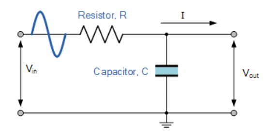
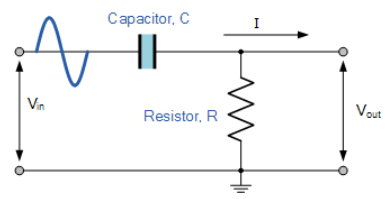
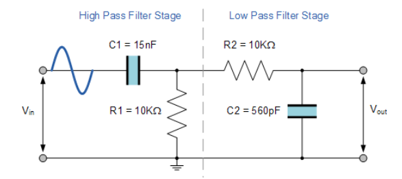
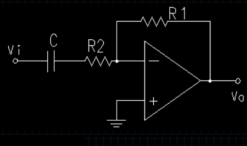
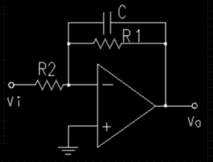
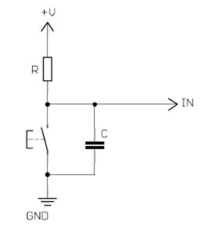

---

# Elektronik Filtre Nedir ?

Elektronik filtreler girişlerine uygulanan elektriksel işaretlerin frekans bileşenlerinden istenmeyenleri engelleyerek istenen değerleri geçiren, aynı zamanda elektriksel işaretleri harmoniklerden ve parazitlerden arındırmaya yarayan elektronik devrelerdir.

## Filtre Türleri ve Sınıflandırmalar

### Frekans Tepkisine Göre

Alçak geçiren (Low-Pass)

Yüksek geçiren (High-Pass)

Band geçiren (Band-Pass)

Band durduran (Band-Stop/Notch)

---

### Tasarım Yaklaşımlarına Göre

Pasif filtreler (R, L, C bileşenleri)

Aktif filtreler (Op-Amp tabanlı)

---

Bobin (inductance) ve kapasitör (capacitance) elemanları farklı frekanslarda farklı davranırlar. **Kapasitör  yüksek frekanslarda kısa devre gibi alçak frekanslarda ise açık devre gibi davranırken bobin  yüksek frekanslarda açık devre gibi, alçak frekanslarda kısa devre gibi davranır.** O zaman bu elemanları çeşitli kombinasyonlarda kullanarak gelen bir işareti frekansına göre geçirebilir, durdurabilir; gelen işaret frekansı için bir alt limit veya üst limit veya her ikisini birden koyabiliriz. Yani gelen işareti filtreleyebiliriz, gerçekleştirdiğimiz devre de bir filtre olmuş olur. 

**Alçak Geçiren Filtre (Low-Pass) :** Alçak geçiren filtre, girişine gelen sinyalin düşük frekanslı bileşenlerini geçirirken, yüksek frekanslı bileşenlerini azaltan (bastıran) bir elektronik filtredir. Yani, belirli bir kesim frekansına kadar olan frekansları olduğu gibi iletir, bu frekansın üzerindekileri ise zayıflatır.Alçak geçiren filtreler,gürültü temizleme, ses işleme, sinyal filtreleme, analog-dijital dönüştürücü öncesi sinyal hazırlama gibi pek çok uygulamada kullanılır.Alçak geçiren filtreler pasif (R, L, C) veya aktif (op-amp gibi) bileşenlerle tasarlanabilir.

**Pasif Alçak Geçiren Filtre**

Direnç (R) ,Kondansatör (C) veya bazen indüktör (L) elemanlarından oluşur.En yaygın pasif alçak geçiren filtre tipi RC alçak geçiren filtredir.

Frekans arttıkça kapasitenin gösterdiği empedans düşer ve kısa devre gibi davranmaya başlar. Bu durumda girişe uygulanan gerilim kapsiteye seri bağlı direnç üzerinde kendini daha çok gösterir. Yani girişine yüksek frekans uygulanan seri bağlı R C devresinde gerlimin büyük bölümü R nin uçlarında olur, çünkü C çok küçük bir empedans gösterir. Frekans düştükçe kapasitenin tepkinliği artar, kapasite uçlarında okunan gerilim değeri de artar. Bu seçicilik  kullanılarak alçak geçiren filtre tasarlanmaktadır.

Kesim frekası, bir filtrenin hangi frekanslara kadar sinyalleri geçirdiğini, hangilerini bastırmaya başladığını belirleyen bir kavramdır. Sinyal işleme ve elektronik devrelerde, istenmeyen frekansları süzmek için çok kritiktir.

Alçak geçiren filtre sadece sinyallerin kesme frekansı noktasının altından geçmesine izin verir.

---

**Kesim Frekansı ($f_c$)**

($f_c$)=1/2πRC

---

**Pasif Yüksek Geçiren Filtre**

Adından da anlaşılacağı gibi pasif yüksek geçiren filtre devresi, sadece seçilen kesme noktasının üzerindeki sinyalleri geçirir, ƒc dalga formundan daha düşük frekanslı sinyali ortadan kaldırır.

---

---

Bu devre düzenlemesinde, kondansatörün reaktansı düşük frekanslarda çok yüksektir. Bu nedenle kondansatör açık devre gibi davranır ve kesme frekansı noktasına ( ƒC ) ulaşılana kadar Vin’deki herhangi bir giriş sinyalini bloke eder. ƒc yine aynı şekilde elde edilir; 

$$
f_c =1/2πRC
$$    

---

**Bant Geçiren Filtre**

Bant geçiren filtre (BPF), yalnızca belirli bir frekans aralığındaki (band genişliği) sinyalleri geçiren, bunun altında ve üstünde kalan frekansları ise bastıran bir elektronik filtredir.Özellikle haberleşme sistemleri, radyo alıcıları, ses işleme, biyomedikal sinyal işleme gibi uygulamalarda kullanılır.

Bir BPF, genellikle alçak geçiren ve yüksek geçiren bir filtrenin seri veya paralel bağlanmasıyla oluşturulur.

---

**Frekans Cevabı Analizi**

Frekans yanıtı tipik olarak **çan eğrisi (bell-shaped)** formundadır ve iki kritik kesim frekansı ile tanımlanır:

 
- **Alt Kesim Frekansı (fₗ):**
  
  fL = 1/2πR1C1
  
  
- **Üst Kesim Frekansı (fₕ):**
 
  fH =1/2πR2C2
 

**Orta Frekans (f₀)** f₀ = √(fL ⋅ fH)

 **Band Genişliği (B)** B = fH − fL    (Hz)

 **Q (kalite faktörü)**:  Q = f₀ / B

---

**Bant Durduran Filtre** 

Bant durdurma filtresi (Bsf), bant geçiren filtrenin tam tersi şekilde çalışan başka bir frekans seçici devre türüdür. Bant durduran filtre, belirli bir frekans aralığını (bandı) bastıran, onun dışındaki düşük ve yüksek frekansları geçiren bir elektronik filtredir. 

Güç sistemlerinde 50 Hz/60 Hz parazitlerini bastırmak ,kablosuz iletişimde belirli bir parazit frekansını engellemek,ses işleme sistemlerinde istenmeyen rezonansları bastırmak ve tıbbi cihazlarda (örneğin EKG/EEG) girişim sinyallerini yok etmek için kullanılır.

Frekans yanıtı tipik olarak **ters çan eğrisi** formundadır.

**Orta Frekans (f₀)** f₀ = √(fL ⋅ fH)

 **Band Genişliği (B)** B = fH − fL    (Hz)

---

**Aktif Filtreler**

 Aktif filtreler, pasif bileşenleri aktif elemanlarla , özellikle operasyonel amplifikatörler (Op-amp)  ve transistörlerle birleştirir . Aktif bileşenlerin dahil edilmesi, daha karmaşık filtre tasarımlarına olanak tanır ve pasif filtrelere göre çeşitli avantajlar sağlar. Aktif filtreler **daha yüksek seçicilik, daha iyi sinyal izolasyonu ve daha hassas transfer fonksiyonları gerçekleştirme** yeteneği sunar. Ayrıca, pasif bileşenlerin neden olduğu sinyal zayıflamasını telafi etmek için kazanç da sağlayabilirler. Bununla birlikte, aktif filtreler bir güç kaynağı gerektirir.

 İşlemsel Amplifikatörler (Op-amp'ler)  , iki giriş voltajı arasındaki farkı yükselten yüksek kazançlı diferansiyel amplifikatörlerdir. Yüksek giriş empedansı, düşük çıkış empedansı ve kontrol edilebilir kazanç gibi özellikler sağlarlar.

---

 **Yüksek Geçiren Opamp**

 

--- 

**Alçak Geçiren Opamp**

---

**Debouncing Nedir ?**

Buton ve anahtar uygulamalarında kontakların istenilen konuma gelmesi sırasında ark oluşur ve insanın bunu algılaması zordur.Ark  istenmeyen bir sinyaldir. Elektronik devrelerde istenmeyen sinyaller donanımsal olarak filtreleme ile bastırılır.Gerekli filtrelemeyle arkı etkisiz hale getirmek mümkündür.  Sinyal içindeki ark kısmında değişim sinyale göre daha fazladır yani sinyale göre frekansı yüksektir. Alçak geçiren bir filtre  yüksek frekanstaki ark sinyalini bastırır , istenilen sinyali geçirir. Bunun en basit yolu  buton uçlarına paralel kondansatör bağlamaktır. **Debouncing RC filtresi (direnç + kondansatör)** ile yapılabilir.

---

