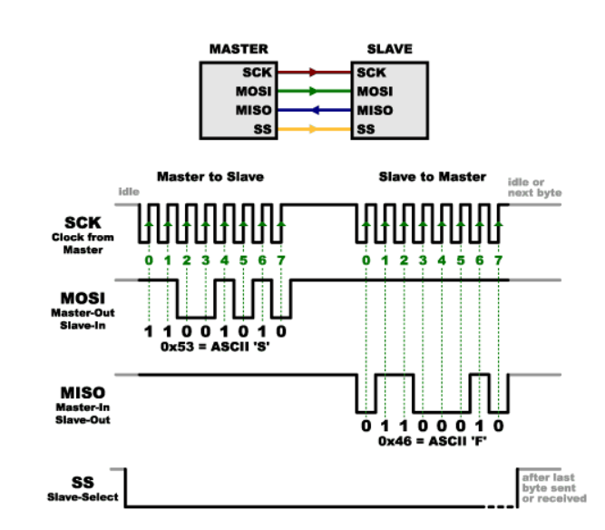
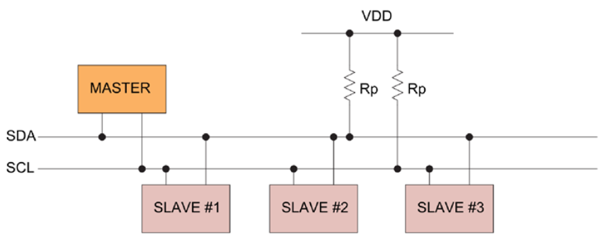
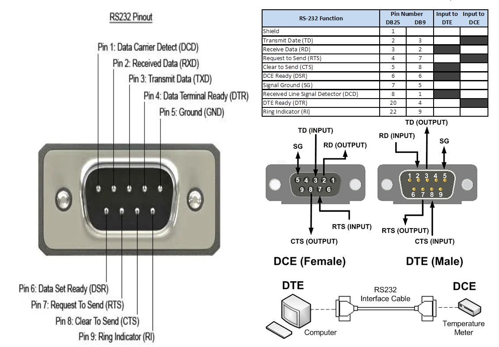
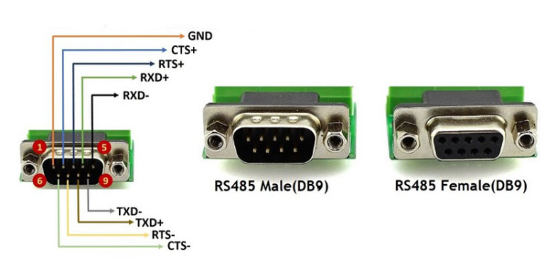
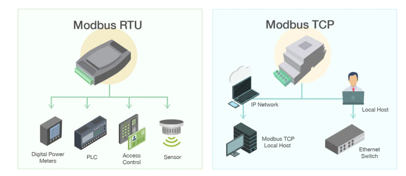

# SERİ HABERLEŞME PROTOKOLLERİ
---

Seri haberleşme protokolleri, verilerin **bir seferde bir bit halinde** iletilmesi işlemidir. Bu iletişim, genellikle kısa mesafeli veri iletimi için kullanılır.

Seri haberleşme için geçerli, standartlaşmış bazı senkron ve asenkron protokoller vardır ve bunlar,

**UART Protokolü**

**SPI Protokolü**

**I2C Protokolü**

**RS-232 Protokolü**

**RS-485 Protokolü**

**CAN Bus (Controller Area Network) Protokolü**

**USB (Universal Serial Bus) Protokolü**

**Modbus Protokolü**

şeklinde listelenebilir.

---
Seri Haberleşme Protokollerinin Temel Özellikleri
---

**Çift yönlü iletişim:** Bazı protokoller tam-dupleks (hem gönderme hem alma aynı anda), bazıları ise yarım-dupleks (tek yönlü iletişim) olarak çalışır.

**Veri iletimi:** Veriler, genellikle 0 ve 1’lerden oluşan bitler olarak bir hat üzerinden iletilir.

**Hız:** Seri protokoller farklı veri iletim hızlarına sahiptir. Bazı protokoller düşük hızda çalışırken, bazıları yüksek hızda veri iletebilir.

**Senkron Haberleşme**

Senkron haberleşme gerçekleştirilirken, gönderilen veri biti ve alınan veri biti birbiriyle uyum içerisinde olmalıdır. İletişimi gerçekleştirecek olan aygıtlar eş zamanlı olarak çalışmak zorundadır. Yani alıcı ve verici aynı saat (clock) üzerinde olmalıdır.

**Asenkron Haberleşme**

Asenkron haberleşme yapmak için belirli bir clock’a ihtiyaç duyulmaz. Veri herhangi bir anda iletilebilir. Belirli standartlar kullanılarak gerçekleştirilir ve **senkron haberleşmeye göre daha yavaş iletim** olur.

---
# UART Nedir?

UART, Evrensel Asenkron Alıcı/Verici(Universal Asynchronous Receiver/Transmitter) anlamına gelir. İki cihaz arasında seri iletişim için kullanılan bir donanım  devresidir.

**UART Cihazlar Nasıl Bağlanır**

Kablonun biri veri iletmek içindir (TX pini olarak adlandırılır) ve diğeri veri almak içindir (RX pini olarak adlandırılır). Ayrıca aynı anda sadece iki UART cihazını birbirine bağlayabiliriz.

UART, alınan paketlerden veri göndermek veya yeniden oluşturmak için **verileri paketlere dönüştürerek** çalışır.

**Seri Veri Gönderme**

UART cihazı veri göndermeden önce, verici cihaz veri baytlarını bitlere dönüştürür. Verileri bitlere dönüştürdükten sonra, UART cihazı bunları iletim için paketlere böler. Her paket bir başlangıç biti, bir veri çerçevesi, eşlik biti ve bitiş bitlerini içerir. Paket hazırladıktan sonra, UART devresi bu paketi TX pini aracılığıyla gönderir.

**Seri Veri Alma**

Alıcı UART cihazı, 1’lerin sayısını hesaplayarak ve pakette bulunan eşlik bitinin değeri ile karşılaştırarak alınan paketi (RX pini aracılığıyla) hatalara karşı kontrol eder. İletimde herhangi bir hata yoksa, veri çerçevesini almak için başlangıç bitini, bitiş bitlerini ve eşlik bitini çıkarmaya devam edecektir. Veri çerçevelerinden tüm veri baytını yeniden oluşturabilmesi için birkaç paket alması gerekebilir. Bayt yeniden oluşturulduktan sonra UART arabelleğinde saklanır.

---
**UART Parametreleri**
--

UART, uygun iletişimin sağlanması için her iki cihazda da aynı olması gereken ayarlara sahiptir. Bu UART ayarları, **baud hızı, veri uzunluğu, eşlik biti, durdurma biti sayısı ve akış kontrolüdür.**

---
**Baud Hızı(Baud Rate)**

Baud hızı, bir UART cihazının iletebileceği/alabileceği saniyedeki bit (bps) sayısıdır. Doğru veri iletimi için her iki UART cihazını da aynı baud hızına ayarlamamız gerekiyor. Baud hızı için genel değerler 9600, 1200, 2400, 4800 , 19200, 38400, 57600 ve 115200 bps’dir.

**Eşlik Biti(Parity Bit)**

Alıcıya iletilen verideki 1’lerin sayısının tek mi çift mi olduğunu söyler. Eşlik Biti için olası ayar Tek(Odd) veya Çift(Even)’tir.

Tek(odd): veri çerçevesinde tek sayıda 1 varsa eşlik biti ‘1’dir.

Çift(even): veri çerçevesinde çift sayıda 1 varsa eşlik biti ‘0’dır.

**Veri Uzunluğu(Data Lenght)**

Veri uzunluğu, veri baytı başına bit sayısını ifade eder.

**Durdurma Biti Sayısı(Stop Bits Number)**

UART cihazları, iletilen bir dizi bitin (paket adı verilen) sonunu işaretlemek için hiç, bir veya iki durdurma bitini kullanabilir.

**Akış Kontrolü(Flow Control)**

Akış Kontrolü, UART üzerinden veri iletirken veri kaybı riskini önleme yöntemidir. UART cihazı, iletimi başlatmak/durdurmak için akış kontrolü olarak özel karakterler kullanır.

**UART Mantık Seviyesi**

UART mantık seviyeleri üreticiler arasında farklılık gösterebilir. Örneğin, bir Arduino Uno’nun 5-V mantık seviyesi vardır, ancak bir bilgisayarın RS232 portu +/-12V mantık seviyesine sahiptir. Bir Arduino Uno’yu doğrudan bir RS232 bağlantı noktasına bağlamak Arduino’ya zarar verir. Her iki UART cihazı aynı mantık seviyelerine sahip değilse, **cihazları bağlamak için uygun bir mantık seviye dönüştürücü devresi** gereklidir.

---

**UART Avantajları**

Sadece iki kablo kullanılır.

Saat sinyaline ihtiyaç duymaz.

Hata denetimine izin vermek için bir eşlik biti vardır.

Her iki taraf da buna göre ayarlandığı sürece veri paketinin yapısı değiştirilebilir.

Yaygın olarak kullanılan bir yöntemdir.

**UART Dezavantajları**

Veri çerçevesinin boyutu maksimum 9 bit ile sınırlıdır.

Birden çok bağımlı(çevre birimi/slave) veya birden çok ana sistemi(kontrolcü/master) desteklemez.

Her UART’ın baud hızları, birbirinin %10’u dahilinde olmalıdır.

---
# SPI  Nedir?

Açılımı “Serial Peripheral Interface” olan SPI, tam çift yönlü (full-duplex) bir iletişim protokolüdür. Bu, **veri gönderme ve alma işlemlerinin aynı anda gerçekleşebileceği** anlamına gelir. İletişim, bir master cihaz ve bir veya daha fazla slave cihaz arasında gerçekleşir.

Master cihaz, **iletişim kurmak istediği slave cihazı seçer ve bu seçimi genellikle SPI donanımında bulunan SS (Slave Select) pini** aracılığıyla yapar. Master cihaz üzerindeki SS pini, kullanıcı tarafından atanır ve hangi slave cihazın aktif olduğunu belirlemek için kullanılır.

SPI’nin bir diğer önemli özelliği, slave cihazların seçilmesi ve yönetilmesinde esneklik sağlamasıdır. Bu özellik, SPI’yi genellikle I2C’den ayıran temel farklardan biridir.

**SPI PİNLER**

**SCLK** : Serial Clock (output from master),senkron seri haberleşme için kare dalga oluşturur. Yani SPI haberleşmesinde senkronu sağlayan saat bulundurur. Saat sinyali master cihaz tarafından üretilir.

**MOSI** : Master Output, Slave Input (output from master). Master’ın çıkış Slave’in giriş olduğu  veri yolunu oluşturur.

**MISO** : Master Input, Slave Output (output from slave). Master’ın giriş Slave’in çıkış olduğu veri yolunu oluşturur.

**SS** : Slave select anlamına gelir. Master cihazın Slave cihazları seçmesine yarar. Master’ın SS pinleri kontrol edilecek Slave cihaza göre seçilir ve kullanıcı tarafından belirlenir.

---

---
Veri iletimi 8-bit olarak gerçekleşir.Slave seçimini yaptıktan sonra master cihazından göndermek istediğimiz veriyi MOSI pinini Lojik 0 ve Lojik 1 şeklinde binary olarak değiştirerek hatta yazarız .Her bir bit için CLK pinini 0 – 1 yapmamız yeterlidir. 

---

--

İletişimin SPI ile gerçekleşmesi için SPI kütüphanesi mikroişlemciye yüklenmesi gerekir.Kodları yazarken hem master hem de slave cihazlar için ayrı ayrı kod yazılır. SPI iletişim için Arduino da hazır bir kütüphane bulunmaktadır. Ancak bu kütüphane Arduino her zaman master konumda olacağı düşünülerek hazırlanmıştır.

Slave cihaza kod yazılırken SPI kütüphanesinin veri aktarımı için kullanılan registerlarda gerekli değişimler yapılır.

---
# I2C Nedir?

I2C, Inter-integrated devre iletişim protokolü anlamına gelir. Kısa menzilli veri aktarım uygulamaları için **sadece 2 kablo gerektiren** seri iletişim protokolüdür. İletişim kurmak isteyen cihazlar, I2C veri yolu üzerine bağlanır. I2C veri yolu, birden çok bağımlı aygıtı ve birden çok ana aygıtı destekler.

Birçok sensör, verilerini mikrodenetleyicilere aktarmak için bu seri iletişim protokolünü kullanır veya bu protokol aracılığıyla farklı bağımlı devreler ana devrelerle iletişim kurabilir.

SPI ve I2C’nin ayırt edici özelliği, I2C’nin iletişimi yürütmek için sadece iki kablo kullanmasıdır.Bu 2 kablodan biri SCL (Serial Clock Line / Seri Saat Hattı) diğeri ise SDA (Serial Data Line / Seri Veri Hattı) olarak isimlendirilmiştir. 

**SCL (Serial Clock Line):** Senkronizasyon için kullanılan saat sinyali kablosudur. Veri iletiminin hızını ve zamanlamasını kontrol eder.

**SDA (Serial Data Line):** Gerçek verilerin (sıcaklık bilgisi, komutlar vb.) taşındığı kablodur.

**Master(Ana) Cihaz**

Ana cihazlar bilgi gönderip alabilir. Slave cihazlar, masterın gönderdiği her şeye tepki verir. Bus hattında bilgi gönderirken, bir seferde yalnızca tek bir cihaz bilgi gönderebilir.

Özetle, veri aktarmak veya farklı sayıda cihazla iletişim kurmak için sadece iki kabloya ihtiyac varcır. Kısıtlı pin durumları söz konusu olduğu zaman I2C aynı anda birden fazla cihaza bağlanmaya izin verir. Tek dezavantajı, bu protokolü uzun mesafeli veri aktarımı için kullanamamaktır.

**Slave(Bağımlı) Cihaz**

Her slave cihazın, veri yolundaki aygıtı tanımak için kullanılan benzersiz bir adresi vardır.Master cihaz (genelde bir mikrodenetleyici), hangi cihazla konuşmak istediğini bu adresle belirler.

**Daha net ve kalıcı olması açısından bir senaryo düşünecek olursak**

---

Öğretmen (master), "Hakan (0x3F adresli slave), tahtaya gel!" diye seslenir.

Hakan yanıt verir, diğer öğrenciler (slave'ler) duyar ama tepki vermez.

Tahta (SDA) bilgi paylaşım yeri, zil sesi (SCL) ise zamanlama sinyalidir.

Yani I2C, cihazların "kim, ne zaman, ne söyleyecek?" kurallarını belirleyen bir sistemdir.

---

**Veri Çerçevesi (Data Frame)**

I2C protokolünde veri transferi belirli bir çerçeve yapısına göre yapılır:

**Başlangıç (Start Condition):** Master cihazın iletişimi başlatmak için SDA hattını yüksekten düşük seviyeye çekmesiyle oluşur (SCL hattı yüksekken).

**Slave Adresi:** Master, hangi slave cihazla iletişim kuracağını belirten 7 bitlik veya 10 bitlik bir adres gönderir.

**Okuma/Yazma Biti:** Slave cihazdan veri okumak veya ona veri yazmak için 1 bitlik bir talimat gönderilir (0 = Yazma, 1 = Okuma).

**Acknowledge (ACK/NACK):** Slave cihaz, adresi tanıdığını ve iletişime hazır olduğunu belirtmek için bir onay sinyali gönderir.

**Veri Transferi:** 8 bitlik veri gönderimi gerçekleşir. Her byte sonrası bir ACK/NACK sinyali alınır.

**Durdurma (Stop Condition):** İletişim, SDA hattının düşükten yüksek seviyeye geçmesiyle sonlandırılır (SCL hattı yüksekken).

---

Her iki hat da "open-drain" yani açık kolektör (veya açık drenajlı) yapıya sahiptir.Cihazlar bu hatlara direkt olarak "1" (yüksek seviye) sinyali gönderemez.Sadece "0" (düşük seviye) sinyali gönderebilirler.Nedeni ise  birden fazla cihaz aynı hatta bağlıyken çakışmayı önlemektir. Bir cihaz "0" gönderdiğinde diğerleri serbest kalır.

Hatlarda sinyalin "1" olması için dışarıdan (besleme hattına bağlı) bir **"pull-up direnci"** gerekir.Yani normalde hat "1"dir (yüksek), ama bir cihaz "0" göndermek isterse hattı aşağıya çeker (GND’ye bağlar).

---

---

**I2C Pullup Direnç Seçimi**

Kullanılacak dirençler için bir hesaplama yolu bulunsa da burada artık standartlaşmış değerler vardır. 

**I2C Modları ve Direnç Aralıkları**

| Mod               | Hız       | Direnç Aralığı      |
|------------------|-----------|---------------------|
| Standart Mod     | 100 kHz   | 5kΩ – 10kΩ          |
| Hızlı Mod        | 400 kHz   | 2kΩ – 5kΩ           |
| Yüksek Hızlı Mod | 3.4 MHz   | 1kΩ                 |

I2C veri yolu, hem SLAVE hem de MASTER olmak üzere birden fazla cihazı destekleyebilir.Tek sınırlama, daha fazla cihaz eklendikçe veri yolundaki kapasitans  ve adres alanıdır (128 benzersiz adres).

I2C Avantajları ve Dezavantajları

**Avantajları**

Çoklu master ve çoklu slave’i desteklediği için çoğu proje uyarlanabilir bir iletişim yöntemidir.

Yalnızca iki kablo kullanır ve çok yönlüdür, farklı bağımlı cihazların gereksinimlerine kolayca uyum sağlayabilir.

**Dezavantajları**

Uzun mesafeli iletişim için yeterli değildir.

Yalnızca iki kablo kullanıldığı için hızı yavaştır.

Direnç kullanımı nedeniyle nispeten daha fazla alan gerektirir.

Cihaz sayısı arttıkça karmaşıklaşır.

---
# RS-232 Protokolü Nedir ?

Açılımı “Recommended Standard 232” olan RS-232, elektronik cihazlar arasında seri veri iletişimini sağlayan bir protokoldür.Bu standart, özellikle bilgisayarlar ve çevre birimleri (örneğin yazıcılar, modemler) arasında veri transferi için yaygın olarak kullanılır.

RS232 seri haberleşme standardı, seri asenkson bir şekilde çalışmaktadır. Bu, **verilerin önceden belirlenmiş bir saat sinyaline ihtiyaç duymadan** transfer edilebileceği anlamına gelir. Veri iletimi, başlangıç biti (start bit), veri bitleri, parite biti ve durdurma biti (stop bit) gibi yapı taşlarından oluşur.Bunun yanında tam çift yönlü- full duplex şeklinde de çalışabilmektedir.

**RS-232’nin Pin Yapısı ve Sinyal Tanımları**

RS-232 protokolü, genellikle 9 pinli (DB9) veya 25 pinli (DB25) konnektörlerle kullanılır. 

---
**TxD (Transmit Data):** Verinin gönderildiği hattır. Veri kaynağı cihazdan (örneğin bilgisayardan) hedef cihaza veri aktarımı sağlar.

**RxD (Receive Data):** Verinin alındığı hattır. Hedef cihazdan gelen veri bu pin üzerinden alınır.

**GND (Ground):** Ortak referans hattıdır. Tüm cihazların doğru bir şekilde iletişim kurabilmesi için gereklidir.

**RTS (Request to Send):** Veri göndermek için hazır olunduğunu belirten bir sinyaldir.

**CTS (Clear to Send):** Karşı cihazın veri alımına hazır olduğunu belirten sinyaldir.

**DSR (Data Set Ready):** Cihazın iletişim için hazır olduğunu belirtir.

**DTR (Data Terminal Ready):** Terminal cihazının hazır olduğunu ifade eder. 

---

---

**RS-232’nin Temel Özellikleri**

**Bağlantı Mesafesi:** RS-232, düşük hızlarda (örneğin 9600 baud) yaklaşık 150 metreye kadar güvenilir bir bağlantı sağlar.

**RS232 Baud Rate ve Kablo Uzunluğu Sınırları**

| Baud Rate | Maksimum Kablo Uzunluğu |
|-----------|-------------------------|
| 2400      | 900 metre               |
| 4800      | 300 metre               |
| 9600      | 150 metre               |
| 19200     | 15 metre                |
| 115200    | 5 metre                 |

**Hız:** Protokol, genellikle 110 ile 115200 baud arasında değişen veri iletim hızlarını destekler.

**Asenkron Yapı:** Saat sinyali gerekmeden, başlangıç ve durdurma bitleriyle veri iletişimi sağlanır.

**Güç Seviyeleri:** RS-232, voltaj seviyelerini belirlemek için ±12V veya ±15V gibi değerler kullanır (lojik 1 = negatif voltaj, lojik 0 = pozitif voltaj).

---

**RS-232’nin Avantajları**

Yıllardır kullanılan bir protokol olduğundan uyumluluk sorunu pek olmaz  .

Uzun mesafeli ve düşük hızda güvenilir iletişim sağlar.

**RS-232’nin Dezavantajları**

Düşük veri hızı modern sistemler için yetersizdir.

Mesafe arttıkça voltaj kaybı nedeniyle güvenilirliği azalır.

Çoklu cihaz bağlantısını desteklemez (tek bir master-slave yapısı vardır).

Bu protokol, günümüzde daha hızlı ve daha esnek protokollerle (örneğin USB) yer değiştirmiş olsa da, endüstriyel sistemlerde ve eski cihazlarda hala kullanılmaktadır.

---

# RS485 Nedir ?

RS485 Seri Haberleşme Protokolü, endüstriyel otomasyon ve kontrol sistemlerinde yaygın olarak kullanılan bir iletişim standardıdır. Bu protokol, birden fazla cihazın aynı veri hattını paylaşarak birbirleriyle veri iletişimi yapmasını sağlar. RS485’in en belirgin özelliklerinden biri, uzun mesafelerde güvenilir ve hızlı iletişim sağlamasıdır. Bu nedenle, fabrikalar, bina otomasyon sistemleri ve enerji dağıtım ağları gibi alanlarda tercih edilen bir haberleşme protokolüdür.

RS485’in temel çalışma prensibi, **veri iletişiminin tek bir verici ve birden fazla alıcı arasında** gerçekleşmesidir. Verici cihaz, verileri RS485 haberleşme standardına uygun bir şekilde hattın üzerine gönderir. Alıcı cihazlar ise bu verileri okur ve gerektiğinde cevaplarını geri gönderirler. RS485, diferansiyel sinyal kullanarak yüksek gürültü toleransı sağlar ve **1200 metreye kadar** iletişim mesafesi sunar. 

 **RS-485 Pinleri ve Görevleri:**

RS-485 fiziksel bağlantı olarak çok farklı konnektörler üzerinden yapılabilir (örneğin DB9, terminal block, RJ45 vb.), ama asıl önemli olan sinyal isimleri ve işlevleridir.

**2 Telli RS-485 (Yarım Dubleks) Sistemi:**

| Pin / Hat Adı       | İşlevi                                            |
| ------------------- | ------------------------------------------------- |
| **A (DATA–)**       | Diferansiyel veri hattı (negatif faz)             |
| **B (DATA+)**       | Diferansiyel veri hattı (pozitif faz)             |
| **GND (opsiyonel)** | Ortak toprak hattı, sistemler arası referans için |

 **4 Telli RS-485 (Tam Dubleks):**

Hem gönderme hem alma için ayrı hatlar kullanılır. 

| Hat Adı          | İşlevi              |
|------------------|---------------------|
| **TX+ (Gönderim +)** | Veriyi gönderme (+) |
| **TX– (Gönderim –)** | Veriyi gönderme (–) |
| **RX+ (Alım +)**     | Veriyi alma (+)     |
| **RX– (Alım –)**     | Veriyi alma (–)     |
| **GND (opsiyonel)**  | Ortak toprak hattı  |

# CAN Bus (Controller Area Network) Protokolü

Açılımı “Controller Area Network” olan CAN Bus, mikrodenetleyiciler ve cihazlar arasında seri iletişim için kullanılan bir protokoldür. 1980’lerde Bosch tarafından geliştirilen bu protokol, **özellikle otomotiv endüstrisinde geniş bir uygulama** alanı bulmuştur.

CAN Bus, çoklu cihazların aynı ağ üzerinde iletişim kurmasına izin veren bir yapı sunar. Bu protokol, mesaj tabanlı bir sistemdir ve herhangi bir cihaz, öncelik sırasına göre veri gönderebilir.

---
**CAN Bus’ın Pin Yapısı ve Sinyal Tanımları**

CAN Bus protokolü genellikle iki hat kullanır:

**CAN High (CANH): Veri sinyalinin yüksek hattıdır.**

**CAN Low (CANL): Veri sinyalinin düşük hattıdır.**

Bu iki hat, diferansiyel bir sinyal sistemi oluşturur ve elektromanyetik parazite karşı direnç sağlar.

---

**CAN Bus’ın Avantajları**

Elektromanyetik parazite karşı dayanıklıdır.

Çoklu cihaz desteği ile esnek bir iletişim yapısı vardır.

Güçlü hata tespit ve düzeltme mekanizmalarına sahiptir.

**CAN Bus’ın Dezavantajları**

Yüksek veri hızı gerektiren uygulamalar için sınırlı bant genişliği.

Mesaj tabanlı yapı nedeniyle karmaşık sistemlerde yönetimi zordur.

CAN Bus, otomotiv dışında endüstriyel otomasyon, tıbbi cihazlar ve uçak sistemlerinde de yaygın olarak kullanılmaktadır.

---

# USB (Universal Serial Bus) Protokolü

Açılımı “Universal Serial Bus” olan USB, bilgisayarlar ve çevre birimleri arasında veri iletimi ve güç aktarımı için kullanılan evrensel bir protokoldür.  Protokol, basitliği ve çok yönlülüğü sayesinde hızla yaygınlaşmıştır.

**USB’nin Pin Yapısı ve Sinyal Tanımları**

USB bağlantıları genellikle 4 pin içerir:

**VCC:** Güç sağlayan hattır (genellikle +5V).

**D+ ve D-:** Veri iletimi için kullanılan diferansiyel hatlardır.

**GND:** Toprak hattıdır.

---
**USB’nin Temel Özellikleri**

**Hız:** USB 1.0 (12 Mbps), USB 2.0 (480 Mbps), USB 3.0 (5 Gbps) gibi farklı versiyonlarda hız seçenekleri sunar.

**Tak ve Çalıştır:** Ek bir yapılandırma gerektirmeden cihaz bağlantısını destekler.

**Güç Aktarımı:** USB, cihazlara güç sağlamak için de kullanılabilir (örneğin, 5V ve 900mA).

---

**USB’nin Avantajları**

Kolay kullanım ve geniş uyumluluk.

Hem veri iletimi hem de güç aktarımı sağlar.

Yüksek hız seçenekleriyle modern sistemler için uygundur.

**USB’nin Dezavantajları**

Kısa mesafeli iletişimle sınırlıdır (genellikle 5 metreye kadar).

Birden fazla cihaz bağlandığında veri yolu tıkanıklığı yaşanabilir.

USB, günümüzde bilgisayarlar, akıllı telefonlar, depolama cihazları ve birçok elektronik cihazda standart bir bağlantı protokolü olarak kullanılmaktadır.

---

# Modbus Protokolü

1979 yılında Schneider Electric tarafından geliştirilen Modbus, endüstriyel cihazlar arasında veri iletimini sağlayan bir protokoldür. Modbus, genellikle PLC’ler, sensörler ve HMI’ler gibi cihazlar arasında iletişim için kullanılır.

**Modbus İletişimi**

Modbus protokolü, cihazlar arasında iletişim kurmak için Master/Slave tekniğini kullanır. Yani, Modbus protokolünü kullanan herhangi bir uygulamada bir Modbus Master ve en az bir Modbus Slave bulunur.
Modbus Master, genellikle birden fazla Modbus Slave cihazı ile iletişim kuran ana kontrol cihazıdır.

Modbus protokolünün, seri port ve Ethernet için çeşitli sürümleri vardır. En yaygın olanlar şunlardır:

**Seri Haberleşmeye Göre Modbus Türleri**

**Modbus RTU**

Modbus RTU protokolü, Master/Slave mimarisine göre düzenlenmiş seri haberleşme protokolüdür. Kullanım kolaylığı ve güvenilirliği nedeniyle yaygın olarak tercih edilir.
İletilen mesajlar 2 bitlik veriler halinde gönderilir ve 16 bitlik CRC (hata kontrol mekanizması) ile güvenli iletişim sağlanır.

**Modbus ASCII**

Bu yapı, verileri ASCII kodlama sistemiyle 8 bitlik kodlar hâlinde iletir. Bu yöntemin avantajı, arka arkaya gönderilen verilerin hata oluşturmadan iletilmesine olanak tanımasıdır.
LRC hata denetimi ile 8 bitten fazla veri gönderilip gönderilmediği kontrol edilir.

**Modbus Plus**

Schneider ve Modicon tarafından geliştirilen bu protokol, küresel bir Fieldbus ağına bağlıdır. PLC, sürücüler ve çeşitli çevre birimlerinde kullanılır.
RS-485 tabanlı bu Master/Slave yapılı protokol, esnek yapısı ve yüksek veri iletim hızı sayesinde endüstriyel uygulamalarda tercih edilir.

---

**Ethernet Tabanlı Modbus Türü**

**Modbus TCP/IP Protokolü**

 Modbus protokolünün, TCP/IP ve Ethernet altyapısı üzerinde
 çalışan versiyonudur.

Modbus mesaj yapısı, TCP/IP ağı ve Ethernet üzerinden uyumlu cihazlar arasında taşınır.
Modbus TCP/IP, fiziksel ağı (Ethernet) ve TCP/IP standardını kullanarak veri iletişimi sağlar.

Standart internet kartları ile çalışan bu yapı, 100 Mbps’ye kadar veri aktarım hızı sunar.
Sunucu (Server) ve istemci (Client) cihazlar arasında çok sayıda bağlantı kurulabilir.
Veri iletim hızı, kullanılan cihazın işlemcisine ve ağ donanımına bağlı olarak değişir.

**Modbus TCP/IP Protokolü Başlık Yapısı**

Modbus TCP/IP mesajları iki ana bölümden oluşur: MBAP (Modbus Application Protocol Header) ve PDU (Protocol Data Unit).

MBAP Başlığı (7 Byte)

Transaction Identifier (2 Byte): Master ve Slave cihazlar arasında eşleşme sağlar.

Protocol Identifier (2 Byte): Modbus için bu değer her zaman "0"dır. Gelecekteki kullanım için ayrılmıştır.

Length (2 Byte): Unit Identifier ve PDU’nun uzunluğunu belirtir.

Unit Identifier (1 Byte): Sistem yönlendirme bilgisini içerir. Ağda bulunmayan uzak cihazları tanımlamada kullanılır.

PDU Bölümü

Fonksiyon Kodu (1 Byte): Master cihazın Slave cihaza ilettiği işlem talebini belirtir.

Veri Alanı: İşleme özel verileri ya da hata kodlarını içerir. Uzunluğu değişkendir.

Modbus’ta Veri Saklama Yöntemi

Slave cihazlarındaki bilgiler dört ayrı çizelgede saklanır:

İki çizelge On/Off (Coil) durumlarını,

Diğer ikisi sayısal değerleri (Register) saklar.

Her bir Coil ya da Register’ın, yalnızca okunabilen (read-only) ve hem okunabilen hem yazılabilen (read-write) türleri vardır.

Her Coil 1 bit’tir ve adres aralığı 0000–270E arasındadır.

Her Register 1 kelime = 16 bit = 2 byte’tır ve yine 0000–270E arası adreslere sahiptir.

Sistem numaraları ve veri adresleri farklıdır. Örneğin; ilk Holding Register'ın sistem numarası 40001, veri adresi ise 0000’dır.

Offset (sapma) kavramı;

Çizelgeler için offset değerleri genellikle: 1, 10001, 30001 ve 40001’dir.

Not: Her üretici, cihazındaki Modbus değişken adreslerini farklı aralıklarda tanımlayabilir.

---

